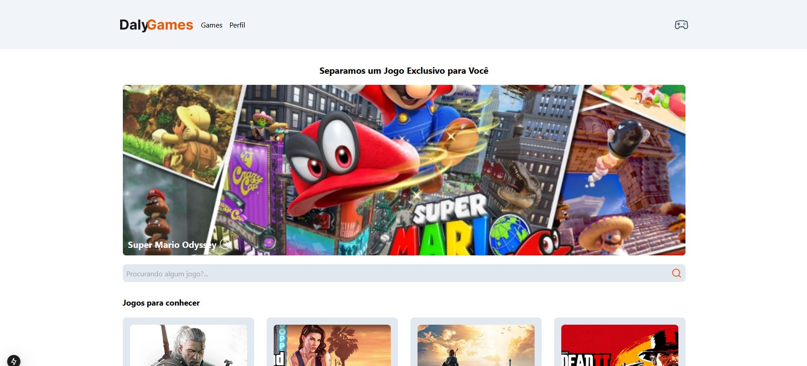
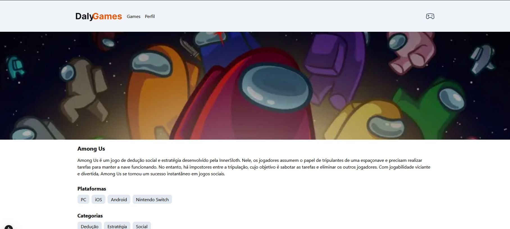
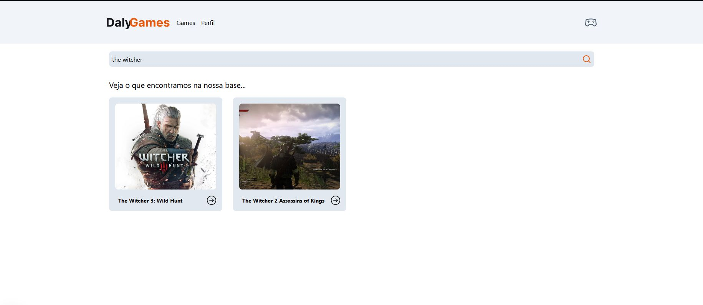

# DalyGames

DalyGames é uma aplicação web desenvolvida com Next.js para descobrir, explorar e gerenciar jogos. A aplicação permite aos usuários buscar jogos, visualizar detalhes de jogos específicos e gerenciar seu perfil com jogos favoritos.
Projeto Foi desenvolido para melhor entendimento e praticar o uso de APIs.

## Funcionalidades

### Página Inicial

A página inicial (`src/app/page.tsx`) exibe um jogo do dia e uma lista de jogos recomendados. Utiliza componentes como `Container`, `GameCard` e `Input`.

### Perfil do Usuário

A página de perfil (`src/app/profile/page.tsx`) exibe informações do usuário e permite adicionar jogos favoritos. Utiliza componentes como `FavoriteCard`.

### Busca de Jogos

A página de busca de jogos (`src/app/game/search/[title]/page.tsx`) permite buscar jogos por título e exibe os resultados da busca.

### Detalhes do Jogo

A página de detalhes do jogo (`src/app/game/[id]/page.tsx`) exibe detalhes de um jogo específico, incluindo plataformas, categorias e jogos recomendados.

## Como Executar

Primeiro, certifique-se de que a API necessária para o projeto está configurada e em execução.

Em seguida, instale as dependências:

```bash
pnpm install
```

Agora, execute o projeto:

```bash
pnpm run dev
```

## Imagens do Projeto

Página Inicial que mostra o jogo do dia para o Usuário:


Tela do Jogo com as informações do jogo Selecionado:


Tela de Pesquisa de Jogo:


Demonstração de como a página fica no mobile:


